# RFC 0007 — Fleet Deployment, Hierarchical Config & Pull-Based OTA

**Status:** draft
**Companion:** `docs/internal/rfcs/0006-local-git-as-argo-source.md`,
`docs/internal/rfcs/0002-private-repo-argocd-auth.md`

## Summary

A cloud *publishing plane* renders a per-robot config hierarchy into a
signed **OCI artifact** (manifests + image refs, atomic) and records a
per-robot **desired version**. Each robot runs an in-cluster **OTA
Download Service** that *polls / calls home*, pulls and stages the
bundle, and a node-level **OTA System Service** that *verifies, gates,
and applies* it by advancing the local git tree at
`/opt/Phantom-OS-KubernetesOptions`. The robot's existing **Local
ArgoCD** then reconciles from `file://` exactly as it does today.
Operators drive everything through the operator-ui (per robot) and cloud
portals (site / customer / global). **The cloud never connects inbound.**

This RFC builds on RFC 0006 (local git as the ArgoCD source) and
preserves its air-gap guarantee: OTA only changes *how a new HEAD lands*
in `/opt/.../.git`, replacing manual `scp` + `dpkg -i` with an
automated, gated, robot-initiated pull.

---

## 0. Areas of work

This RFC is one design within a larger program. The program splits into
eight workstreams. This document **details areas 0, 1, and 6**
(deployment flows + config source/hierarchy + the OTA delivery channel,
operator surfaces, and notifications); areas 2–5 are sibling workstreams
shown here for context, and **area 7 is a preliminary ask** — a sketch of
how the platform integrates with the on-robot AI assistant that is being
built as a separate workstream, not a worked design.

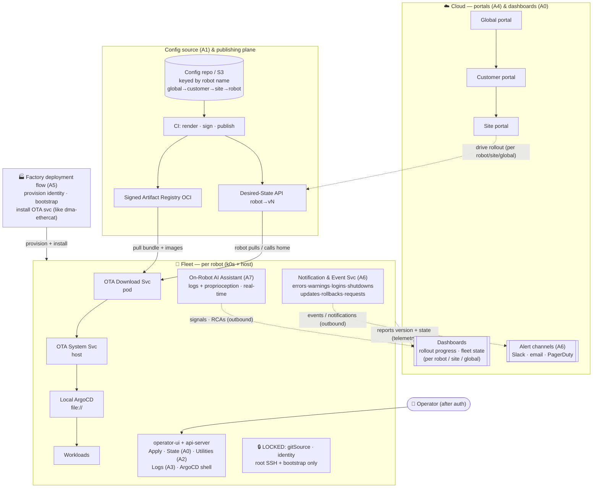

| # | Area of work | Scope | In this doc? |
|---|---|---|---|
| **0** | Robot deployment flows + dashboards | Deploy **per-robot / per-site / global**; dashboards for rollout *progress* and fleet *state* (running / error / degraded) | ✅ Detailed (§2, §3, §11, §14) |
| **1** | Config source separation | Robot configs in a **separate repo or S3 bucket**, installed **by robot name**; hierarchical `global→customer→site→robot` | ✅ Detailed (§5, §13) |
| **2** | Operator utilities exposed | **Joint zeroing** and **EtherCAT aliasing** surfaced to operators in the UI (not SSH-only) | ◻ Sibling — surfaced via operator-ui (§3) |
| **3** | Logging views exposed | Operator-facing **log views** per robot / workload | ◻ Sibling — surfaced via operator-ui (§3) |
| **4** | Cloud portals | **Site / customer / global** portal views over the fleet | ◻ Sibling — consumes desired-state + telemetry |
| **5** | Factory deployment flows | Provision identity, initial bootstrap, install host services **at the factory** before field deploy | ◻ Sibling — produces field-ready robots |
| **6** | Notifications & events | Emit robot events (errors, warnings, operator logins, shutdowns, updates, rollbacks, service requests) outbound; cloud fans out to dashboards + alert channels | ✅ Detailed (§9) |
| **7** | On-robot AI assistant (logs + proprioception) | Real-time on-device LLM (separate workstream): signal potential errors/warnings, generate evidence-cited RCAs, recommend predictive-maintenance tasks, offline-capable operator chat | ◻ Preliminary — pending the on-robot LLM workstream; integration sketch only (§10) |

---

## 1. Requirements & assumptions

The design is constrained first by what RFC 0006 already guarantees and
must not regress, then by the new cloud-authored hierarchy and delivery
goals.

### Requirements

- **R1 — No inbound dependency; robots call home.** Updates must not
  *require* an inbound connection from the cloud — the robot initiates
  all update traffic (poll / call-home / pull). The reachability
  boundary is a *policy default, not a hard architectural limit*: the
  design stays flexible so a future secured push / bidirectional channel
  can be added without reworking the apply path.
- **R2 — Local ArgoCD unchanged.** Reconciliation stays
  `file:///opt/Phantom-OS-KubernetesOptions` over the read-only
  repo-server hostPath. OTA only changes how a new HEAD lands there.
- **R3 — Config↔image atomicity.** Manifests and the image digests they
  expect advance together; no `ImagePullBackOff` drift.
- **R4 — Hierarchical config.** `global → customer → site → robot`
  precedence, authored centrally, sourced from a separate repo / S3
  keyed by robot name (Area 1).
- **R5 — Offline-tolerant.** Loss of cloud connectivity leaves the robot
  running its last-applied snapshot indefinitely; updates resume when
  reachable.
- **R6 — Safe apply.** Gated rollout, post-apply health gate, and
  auto-rollback that uses *only local state*.
- **R7 — Signed & least-privilege.** Artifacts verified before they
  touch the OS; the network-facing component cannot write the OS, the
  OS-writer cannot accept inbound network.
- **R8 — Backward compatible.** Opt-in; a robot with no OTA components
  and no hierarchy behaves exactly as today.
- **R9 — Safety-locked fields.** Identity-defining fields (`gitSource`,
  robot identity) are not editable from the UI; changing them requires
  root SSH + a bootstrap reset.

### Assumptions

- **A1.** Each robot is a single-node k0s cluster with Local ArgoCD and
  the RFC 0006 `/opt/.../.git` + hostPath setup already in place.
- **A2.** Robots have *intermittent* outbound reachability to a cloud
  registry + the Desired-State API, possibly behind NAT/firewall.
- **A3.** A container registry (or mirror) reachable by robots serves
  image layers — the gated two-step relies on images being pullable
  before a config apply.
- **A4.** A CI pipeline renders, signs, and pushes bundles; humans only
  edit + merge + promote.
- **A5.** `host-config.yaml` remains the machine-local last-mile
  (identity, physical wiring, dev mounts, `gitSource`) and is not part of
  the cloud hierarchy.
- **A6.** The OS image carries the cosign public key and both OTA
  components, so trust is rooted in the signed OS, not the network.
- **A7.** One version per robot (all stacks move together), consistent
  with RFC 0006.
- **A8.** Robots are provisioned and given identity at the factory
  (Area 5) before field deploy.

---

## 2. Publishing a bundle — what the user actually does

From an operator's seat, shipping a change is five short steps. Only
steps 1, 3 and (when gated) 4 are human actions; CI does the rendering,
signing and pushing.

| # | Who | Action | Command / surface |
|---|---|---|---|
| 1 | human | Edit the value in the right hierarchy layer and merge to the config repo / S3 | `edit layers/customers/acme/sites/sf-7/… ; git commit ; PR merge` |
| 2 | CI | Auto: render each affected robot leaf, gather image digests, sign, push as a new version | `kustomize build robots/<r>/<stack> → oras push …:vN ; cosign sign` |
| 3 | human | Promote: declare which robots move to `vN` and the rollout policy/order (per-robot / per-site / global) | `fleetctl promote mk11000010 --version vN --policy approval` (or portal) |
| 4 | human | If gated: release the approval per canary → site → customer → fleet | operator-ui or portal "Approve" button |
| 5 | human | Watch: per-robot version + health; failures auto-roll-back and halt the rollout | portal dashboard (read-only) |

### Common case: updating a single container image

Most changes are just bumping one workload's image. That is a one-line
edit to an `images:` override in whichever hierarchy layer scopes the
change — global (whole fleet), customer, site, or one robot. Kustomize
rewrites the matching container in the rendered snapshot; no Deployment
YAML is hand-edited.

```yaml
# layers/robots/mk11000010/kustomization.yaml — bump ONLY dma-streams on one robot
images:
  - name: registry/phantomos/dma-streams
    newTag: 2026.06.22-rt3          # prefer a digest for reproducibility:
    # digest: sha256:9b9a5a…  (pins exactly, RFC-0006-style)
```

On merge, CI re-renders the leaf, recomputes `image-refs.json` with the
new digest, signs, and pushes `:vN`. Then the **gated two-step**
guarantees safety on the robot: ① the Download Service pulls the new
image into the local containerd store; ② the System Service's
image-pairing gate refuses to commit the snapshot until every digest in
`image-refs.json` is present locally. ArgoCD never reconciles to a
manifest whose image the robot can't run.

Scope follows the layer you edit: the same `images:` block in
`layers/global` rolls the image to the whole fleet; in a robot layer to
exactly one machine.

---

## 3. Operator-UI surface — start, observe, edit

Each robot is operated through the **operator-ui**, which pairs with the
robot (reusing the existing `operator-ui-pairing` flow) and talks to the
in-cluster `phantomos-api-server`, which owns authentication /
authorization. The same surfaces are mirrored in the multi-robot **cloud
portals** (Area 4) — operator-ui for the at-robot/single-robot case,
portals for staged rollouts; both write through the same API.

### ① "Check & apply now" button

Robots poll/call-home on an interval, but an operator shouldn't have to
wait. The button forces an immediate call-home: the Download Service
polls now, and if a version is staged or awaiting approval, begins the
gated apply. It doubles as the **approval-release** control (Interaction
Model 2). Triggering is the only "start" action — actual apply still
runs the full verify → gate → health → rollback path; the button can't
bypass safety.

### ② Deployed-manifest & state view

A read-only view of *what is actually on the device and whether it's
healthy*:

- **Applied version** — the bundle `vN` + source SHA currently committed
  at `/opt/.../.git` HEAD, per stack.
- **Per-workload state** — `Running` / `Syncing` / `Degraded` / `Error`,
  from ArgoCD Application sync/health + pod status for each app
  (dma-streams, positronic, state-estimator, …).
- **Pending** — a newer version staged or awaiting approval (with what
  changed).
- **History** — last apply outcome and any auto-rollback, with
  timestamps.

Backed by `phantomos-api-server` aggregating ArgoCD Application status +
the OTA System Service's applied-version record + live pod statuses.
This is the operator's single "what's deployed / is it OK?" pane, and the
same data feeds the cloud dashboards (Area 0).

### ③ `host-config.yaml` editor + Apply button (after auth)

Operators edit the machine-local last-mile from the UI — dev mounts,
tunables, the *unlocked* parts of `host-config.yaml` — then press
**Apply** to deploy. Apply flows through the **same gated path** as an
OTA bundle, so a bad edit can't strand the robot.

```mermaid
sequenceDiagram
  autonumber
  participant UI as operator-ui
  participant API as phantomos-api-server
  participant SS as OTA System Service (host)
  participant ETC as /etc/phantomos
  participant LA as Local ArgoCD
  UI->>API: authn/authz; submit edited host-config.yaml
  API->>SS: validate (host-config.py validate); reject locked-field changes
  Note over UI,SS: operator presses Apply
  SS->>ETC: write file (prior kept); re-render Application + re-inject patches
  SS->>LA: refresh → reconcile → health-gate → auto-revert on failure
```

> **🔒 Locked fields — `gitSource` and robot identity.** These define
> *what the robot is* and *where its deployment source lives*; a wrong
> value bricks bringup and can't be safely self-healed. They are
> therefore **not editable from operator-ui**. Changing them requires an
> operator to `ssh root@<robot>` and re-run the bootstrap script to
> reset — a deliberate, high-friction, credential-gated action. The
> api-server's validation step rejects any submission that attempts to
> alter a locked field, surfacing a clear "use bootstrap to change this"
> message.

### ④ ArgoCD container shell (where applicable)

Operators (and on-call engineers) can open a **bash shell into a running
container** from the ArgoCD UI for diagnostics — e.g. inspecting the
state-estimator or an EtherCAT bridge. This uses ArgoCD's built-in **web
terminal (exec)**, enabled via `exec.enabled: true` in `argocd-cm` and
gated by ArgoCD RBAC (`p, role:operator, exec, create, …`). "Where
applicable" = containers that ship a shell; minimal/distroless images
won't have one, and that's expected. Exec is audit-logged and restricted
to a privileged operator role.

### ⑤ Issue history & resolutions

A per-robot (and fleet-aggregated) log of issues seen on the device and
how they were resolved, surfaced in operator-ui and the portals. It is
the institutional memory an operator — or the AI assistant (§10) —
consults when a symptom recurs. Each entry records:

| Field | Meaning |
|---|---|
| `time` | when the issue was observed / opened (plus `resolved_time`) |
| `operator_name` | the human who handled it |
| `operator_id` | their authenticated ID (ties to the login audit, §9) |
| `resolution` | what fixed it (free text + optional linked runbook / RCA) |

Plus context the UI fills automatically: `robot`, `severity`, short
`title` / `description`, `status` (open / resolved), and the `applied
version` at the time. An entry can be opened automatically from a
notification event (§9) or raised manually as a service request, and is
retrievable by the AI assistant (§10) as prior-resolution context for its
RCAs. Stored append-only and tamper-evident for audit.

### ⑥ Task timetable & scheduled maintenance

A forward-looking **timetable of upcoming tasks** for the robot, shown in
operator-ui and the portals — the counterpart to the backward-looking
issue history (§3 ⑤). It answers "what is due on this robot, and when".

Task types include: **maintenance**, **joint zeroing**, **EtherCAT
re-aliasing**, **recalibration**, **scheduled system updates**, and
inspections. Each entry records:

| Field | Meaning |
|---|---|
| `type` | maintenance / joint-zero / ecat-alias / recalibration / update / inspection |
| `due` | scheduled time or window (and recurrence, if any) |
| `origin` | how it was raised: `scheduled` · `AI-recommended` (§10) · `operator` |
| `status` | upcoming / due / in-progress / done / skipped |
| `requires_safe_state` | whether the robot must be parked/limp to run it |
| `runbook` | link to the operator utility (Area 2) or procedure that performs it |

Entries arrive three ways: **scheduled** (recurring, e.g. monthly
maintenance), **AI-recommended** (the on-robot assistant proposes a
re-zero from torque-ripple drift, §10), or **operator-created**. Tasks
that touch hardware (joint zeroing, ecat re-aliasing) require a safe state
and are executed through the operator utilities (Area 2) — the timetable
schedules and tracks them; it does not itself actuate. Due/overdue tasks
raise notifications (§9) and show on the dashboards.

### ⑦ Config editor (JSON / YAML)

A tool for operators to **edit the robot's JSON/YAML config files** (§6 — phantom robot config,
camera, diagnostics, application configs, and `host-config.yaml`) directly in the UI, so a value can be
corrected without SSH or a CI round-trip.

On **Commit**, the change is:

- **committed to the robot's local git** working copy of the config (so the local source is tracked and
  updated), **and**
- **pushed to the remote** config repo / storage (§6) with the **config version number incremented**, and
- recorded with the **operator's name** and a required **commit message** stating the reason for the change.

Before commit it **validates** the file (JSON/YAML well-formedness + per-type schema where known) and
refuses malformed input. The version bump + operator + reason give every config change provenance — the
same audit trail the issue history (⑤) and notifications (§9) draw on. Locked identity fields in
`host-config.yaml` stay locked (③): the editor surfaces them read-only and points edits to the bootstrap
path. This is the config **write-path** (the counterpart to §6's read/delivery); it updates config
*files*, not manifests, so it does not go through the OTA bundle / ArgoCD — affected workloads pick up
the change on reload/restart.

Design note: **commit-local-then-push** — the local commit is authoritative for the robot's running
workloads while the remote stays the fleet source of truth. If the push fails (offline), the local
commit stands and the push retries — consistent with the offline-tolerant, call-home model.

**Decision C4 — how the config push happens: direct vs brokered** (continues the §6 config decisions)

Either way the **remote auto-increments the config version on every push** — the editor never picks a
version; the write side assigns the next one.

| Option | Pros | Cons |
|---|---|---|
| **Direct robot push** — robot holds write credentials to the repo/S3 | Simplest; no extra service; offline-then-retry needs no cloud broker | **Write credentials on every robot** (large attack surface); per-robot creds to rotate; validation / version-bump / audit enforced client-side, i.e. not really enforced |
| **Brokered via the orchestration service** — robot → authenticated API → service commits & pushes | Robot holds **no repo/storage write creds** (just its existing call-home token); auth, schema validation, **monotonic version bump**, provenance and tenancy enforced in **one** place; serializes concurrent edits so two operators can't clobber; one place to rotate creds | Needs connectivity for the push step; the broker is one more service + an availability dependency for pushing (mitigated by the local commit holding and the push queuing on reconnect) |

**Recommendation: brokered.** The robot already calls the orchestration service home; the editor submits
the proposed file + operator + reason, and the **service** validates, commits/pushes to the remote, and
assigns the next version — recording provenance centrally. The robot never holds repo/S3 write
credentials (only its call-home token), keeping the write surface off the fleet and putting
versioning, validation, and audit in one enforced place. Offline, the local commit (⑦) still stands and
the brokered push is queued and flushed on reconnect.

### Why not just edit `host-config.yaml` in ArgoCD's web UI?

**ArgoCD's UI cannot edit or deploy `host-config.yaml` — a separate path
is required.** Three reasons:

- **It's a host file, not a k8s/git object.** `host-config.yaml` lives at
  `/etc/phantomos/`. ArgoCD only reconciles git → cluster; it has no API
  to write a file on the node.
- **What Argo can edit doesn't persist correctly.** Live-resource edits
  are reverted by `selfHeal`; Application-CR parameter overrides live in
  the Application object, not in `host-config.yaml`, so they diverge and
  are blown away on the next re-bootstrap (two sources of truth → drift).
- **The git source is read-only.** Under RFC 0006 the repo-server mounts
  `/opt/.../.git` read-only — Argo cannot commit, so "edit via git
  through Argo" isn't available on the robot.

**Resolution:** a dedicated authenticated path — operator-ui →
`phantomos-api-server` → OTA System Service — which makes the System
Service the single privileged applier for *both* cloud OTA config and
local host-config edits. One gate, one rollback, one audit log. (This
path mutates a privileged host file post-auth — flag for a security
review at implementation: authz tiers, locked-field enforcement, audit
logging.)

---

## 4. System architecture

The design splits cleanly across a **network boundary**. Above it, the
cloud authors and publishes. Below it, each robot pulls and applies
locally. **Every arrow that crosses the boundary is robot-initiated**
(call-home / pull / report); per R1 the boundary is a policy, leaving
room for a future secured cloud→robot channel.

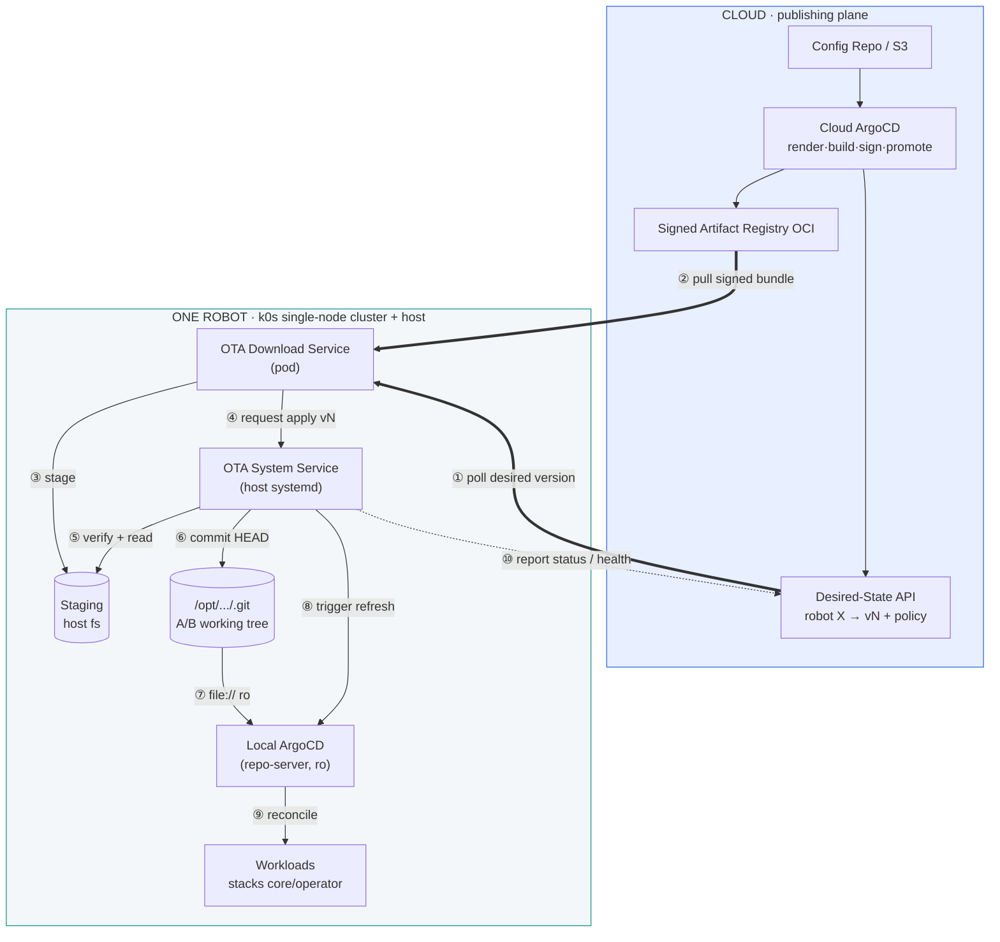

> **Invariant preserved.** Steps ⑥–⑨ are byte-for-byte today's RFC 0006
> flow: a git HEAD advances in `/opt/Phantom-OS-KubernetesOptions`, Local
> ArgoCD clones `file://` over a read-only hostPath, reconciles, done.
> OTA only changes *how the new HEAD gets there* — replacing manual `scp`
> + `dpkg -i` with an automated, gated pull. Steps ①, ②, ⑩ are the only
> cross-boundary traffic, all robot-initiated.

---

## 5. Config hierarchy (the payload being delivered)

OTA is the transport; the hierarchy is the cargo. The config lives in a
**separate repo or S3 bucket** (Area 1), keyed by robot name, and
cascades through four tiers using Kustomize **components** — applied in
order, last patch wins, giving exactly `global → customer → site → robot`
precedence. The cloud renders the robot's leaf into a single flat
snapshot before shipping, so the robot never evaluates the hierarchy
itself. Note (see §6, C3): with the **robot config files fetched
separately**, this snapshot carries only *manifests*, so robots that
share a manifest variant share one bundle — a per-robot bundle is needed
only when a robot has genuine manifest-level overrides, not merely
per-robot config data.

```yaml
# robots/mk11000010/core/kustomization.yaml — the leaf the cloud renders
resources:
  - ../../../base/stacks/core        # WHAT runs (unchanged from today)
components:                          # HOW it's tuned — order = precedence
  - ../../../layers/global           # fleet-wide defaults
  - ../../../layers/customers/acme   # all Acme robots
  - ../../../layers/customers/acme/sites/sf-7   # this site
  - ../../../layers/robots/mk11000010           # this robot (wins)

# Cloud build step → one atomic, signed artifact:
# kustomize build robots/mk11000010/core > snapshot/stacks/core/all.yaml
# oras push registry/…/mk11000010:vN  snapshot/ + image-refs.json + sig
```

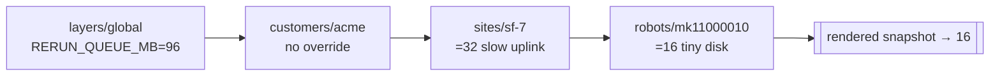

**Precedence example.** `RERUN_QUEUE_MB`: global `96` → site sf-7 (slow
uplink) overrides to `32` → robot mk11000010 (tiny disk) overrides to
`16`. Removing the robot layer falls back to `32`; removing the site too
falls back to `96`.

---

## 6. Config handling

§5 covers the **Kubernetes manifests** (the kustomize cascade). This section covers the
**robot/application config files** those workloads consume — the per-robot data that makes
`mk11000010` behave like *that specific robot*: its calibration, kinematic model, camera setup, etc.
These are distinct from manifests and are keyed by **robot SKU → robot id**.

### Config types

| # | Config | Example path | Purpose |
|---|---|---|---|
| 1 | Phantom robot config | `mk11000001.json` | the per-robot master config (identity-specific parameters) |
| 2 | Camera config | `head_camera.json` | camera intrinsics/extrinsics, stream setup (per camera) |
| 3 | URDF | `mk11000001.urdf` | kinematic + dynamic model used by control/IK/SE |
| 4 | MuJoCo model | `mujoco/mk11000001.xml` | simulation model for the same robot |
| 5 | Diagnostic config | `diagnostics.json` | diagnostic checks, limits, thresholds |
| 6 | Application configs | _TBD_ | per-application runtime config (to be enumerated) |
| 7 | `host-config.yaml` | `host-config.yaml` | machine-local last-mile (identity, wiring, `gitSource`); edited via operator-ui with locked fields (§3 ③) |

### Repo layout — keyed by SKU then robot id

All config files live in **one git repo**, organized **repo → robot SKU → robot id → files**:

```text
config-repo/
  mk1/
    mk11000001/
      mk11000001.json          # phantom robot config
      head_camera.json
      mk11000001.urdf
      mujoco/mk11000001.xml
      diagnostics.json
      host-config.yaml
    mk11000002/
      …
  mk2/
    mk21000001/
      …
```

The SKU tier (`mk1`, `mk2`, …) groups robots of the same hardware generation; the robot-id tier
(`mk11000001`) holds that unit's files. A robot only ever consumes its own
`<sku>/<robot-id>/` subtree.

### Phase 1 — single repo, vended to robots

For Phase 1, all configs live in **one git repo** (above). A robot is vended **only its own files**,
keyed by identity (`<sku>/<robot-id>`) — which the robot already knows from its host-config identity.
Two delivery substrates are on the table:

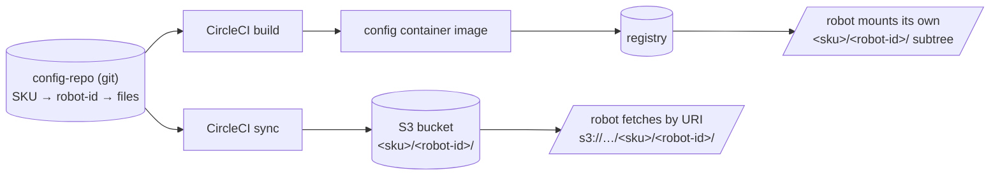

**Decision C1 — delivery substrate (+ granularity)**

| Option | Pros | Cons |
|---|---|---|
| **CircleCI-built container image** (robot mounts its subtree) | Self-contained; reuses the **registry / air-gap pull path the robot already has**; content-addressed by digest; no extra credentials | A build per change; a whole-repo image grows with the fleet (mitigate with per-SKU or per-robot tags, at the cost of build fan-out) |
| **S3 bucket, fetched by constructed URI** | Robot pulls **only its own keys** via a deterministic URI built from its **SKU + name** (`s3://phantom-os-config/<sku>/<robot-id>/`); updating a config is just an upload (no rebuild); **this is the Phase-2 substrate** (§5, area 1) — least rework later | Needs S3 credentials + a small fetcher on the robot; not signed/atomic unless added; offline use needs a cached copy |

**Recommendation:** if the first demo should be **self-contained and reuse the existing registry**,
start with the **whole-repo container** (mount the `<sku>/<robot-id>/` subtree). But since **S3-by-URI
is exactly the Phase-2 path**, prefer **S3** if you're willing to add a fetcher + scoped credentials
now — it removes the Phase-2 migration and gives per-robot scoping for free. Either way the robot
derives `<sku>/<robot-id>` from its own identity and takes only its slice.

**Decision C2 — how configs reach workloads**

| Option | Pros | Cons |
|---|---|---|
| **Separate config container, copied/mounted to a known host path** | Decouples config from app images; update config without rebuilding apps; mirrors the dma-ethercat installer pattern | Config lifecycle separate from the app |
| Bake configs into each workload image | Nothing extra to deliver | Couples config to image; can't change a value without an app rebuild (anti-pattern) |

**Recommendation: a separate config container**, init-copied/mounted to a known path keyed by robot id.

**Decision C3 — configs in the OTA bundle, or fetched separately? (bundle granularity & storage)**

First, a clarification: R3's *manifest↔image* atomicity stays inside the bundle **either way** — this
decision is only about the **robot config files** (the §6 types), which are per-robot *data*.

| Option | Pros | Cons |
|---|---|---|
| Pack configs **into** the bundle | One signed artifact; manifests + images + config roll back as a unit; nothing else to fetch | A distinct rendered + signed bundle **per robot** per version → storage and publish work scale **O(robots × versions)** |
| Keep configs **separate** (S3 by URI; C1) — bundle carries only manifests + image-refs | **No per-robot bundle needed**: the bundle varies only with *manifests*, so robots of a SKU/variant **share one bundle** → storage ≈ **O(SKUs × versions)**; a config change is an upload, not a new signed bundle | Config files aren't covered by the bundle signature or its atomic rollback; their integrity / version / rollback are handled separately |

**Recommendation: separate** (consistent with C1's S3 lean). Because the per-robot variation moves out
of the bundle, **you no longer mint a bundle per robot** — robots sharing a manifest variant pull the
same shared bundle, cutting storage and publish cost from per-robot to per-SKU/variant. Re-establish a
sufficient, explicit atomicity by **pinning the expected config version/digest** in the bundle's
`meta.json` (or desired-state); the System Service verifies the fetched config's digest before commit
(§8). Robot config then versions and rolls back on its own track (S3 versioning), referenced — not
embedded — by the deployment.

### Phase 2 — fold into the per-robot OTA bundle

Under the OTA design, these config files become part of the robot's **rendered per-robot bundle**
(§5), sourced from the config repo/S3 keyed by robot name and delivered **atomically with manifests +
image refs** in the signed bundle (§13), applied by the System Service (§8). Phase 1 is the bridge:
same repo, same SKU→robot-id keying, simpler delivery (container or S3) — and if Phase 1 uses **S3**,
the substrate already matches Phase 2, so only the packaging-into-the-bundle step is added later.

---

## 7. Component A — OTA Download Service

**(in-cluster pod)** Its single job is **acquisition**: learn what
version this robot should be on, fetch that bundle, verify it is intact,
stage it on the host, and ask the system service to apply it. It holds
**no privilege to mutate the OS** — deliberately, so a compromised pod
cannot rewrite the deployment source.

**Responsibilities**

- **Poll / call home** to the Desired-State API for `{robot, stack} →
  version` on an interval (+ jitter), or immediately when the operator
  presses "check & apply now".
- **Pull** the signed OCI bundle for the target version from the registry.
- **Integrity check** — verify digest/size; resumable, bandwidth-capped
  downloads for poor links.
- **Decrypt encrypted bundles** — when a bundle (or a config artifact) is
  shipped **encrypted at rest** for confidentiality, the Download Service
  fetches the ciphertext and decrypts it during staging (envelope
  encryption: a per-bundle data key unwrapped with a robot-held key). It
  stages plaintext only into the quarantine dir for the System Service;
  the registry/S3 never holds anything but ciphertext. (Decryption is for
  *confidentiality*; it is **separate from** the cosign *authenticity*
  check the System Service still performs before apply, §8.)
- **Stage** to a shared host path the system service also mounts.
- **Hand off** — drop a request descriptor and notify the system service
  (it does *not* apply).
- **Report** download/apply status back up to the API (robot-initiated;
  feeds dashboards).

**Boundaries & properties**

- **Outbound-only networking.** Talks to API + registry; nothing listens
  inbound.
- **No write access to `/opt`.** Stages to a quarantine dir only.
- **Credential scope:** a pull-only registry token + API token (the
  evolution of RFC 0002 — a pull token, not a git deploy key on every
  robot).
- **Crash-safe:** stateless; on restart re-reads desired state and
  resumes.
- **Offline-tolerant:** if the API/registry is unreachable, it idles; the
  robot keeps running its last-applied snapshot indefinitely.

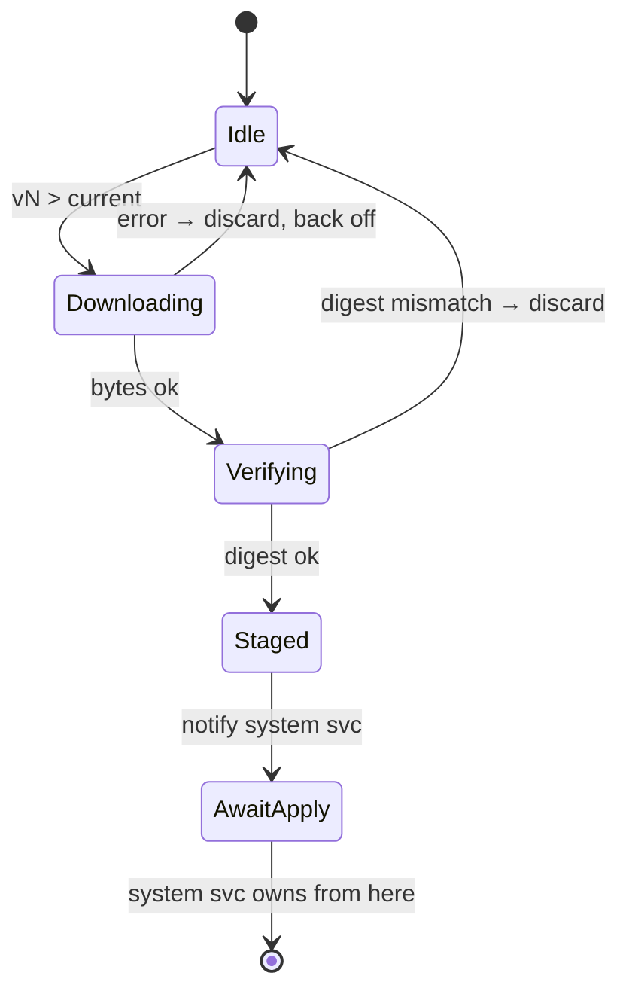

*Acquisition-only; it stops at AwaitApply and never touches the OS.*

---

## 8. Component B — OTA System Service

**(host systemd unit)** The privileged half. It is the **only**
component allowed to mutate the deployment source of truth. It verifies
provenance, enforces the rollout gate, applies the snapshot by advancing
the local git tree, triggers ArgoCD, watches health, and **auto-reverts**
on failure — all without a network round-trip, so a bad config can never
strand the robot offline.

> **Installation — like `dma-ethercat`.** The System Service follows the
> established installer pattern: a bootstrap-applied
> `kubectl apply -k manifests/installers/ota-system-service` Job runs a
> container whose image is baked into the OS, copies the host artifact
> (binary + systemd unit) to a `hostPath` (e.g.
> `/var/lib/ota-system-service/`), drops a sentinel, and exits. The host
> `systemd` unit then runs the service. No new install machinery — the
> same one-Job, hostPath-copy, sentinel approach `dma-ethercat` already
> uses, managed by `bootstrap-robot.sh`, idempotent across re-installs.

**Responsibilities**

- **Verify signature** (cosign / public key baked into the OS image)
  before reading staged bytes.
- **Image-pairing check** — refuse to apply config whose image tags
  aren't already in the local containerd store (keeps RFC 0006's
  config↔image atomicity).
- **Rollout gate** — honor the bundle's policy: auto, operator-approval,
  or safe-state-only.
- **Apply (A/B)** — commit the new snapshot as a new HEAD in
  `/opt/…/.git`, keeping the prior commit as the rollback target.
- **Trigger** ArgoCD hard-refresh and watch sync to Healthy.
- **Health-gate + auto-revert** — if sync fails or post-apply health
  checks fail within a window, reset HEAD to the previous snapshot and
  re-refresh.
- **host-config apply** — also services validated `host-config.yaml`
  edits from the api-server (§3), enforcing locked-field rejection,
  through the same gate.
- **Record** applied version + outcome for the download service to
  report upward.

**Why host-level, not in-cluster**

- `/opt/…/.git` is a **hostPath** the ArgoCD repo-server mounts read-only
  — only a node process can write it.
- Must function **even if the cluster is unhealthy** (a bad config could
  break the API server; recovery can't depend on a pod).
- Privilege isolation: the network-facing pod has no OS write access; the
  OS-writing process has no inbound network. Compromise of one ≠
  compromise of the robot.
- Mirrors today's model — `dpkg -i` + `bootstrap-robot.sh` are already
  host-level.

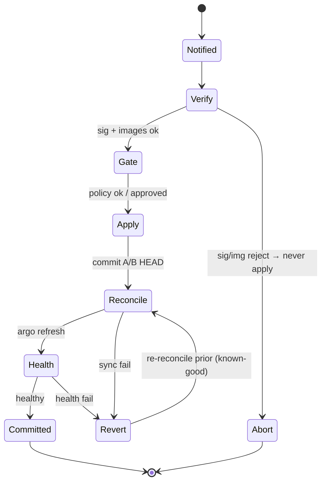

*Apply is transactional: any failure resets to the last known-good HEAD
using only local state.*

### Post-update verification checklist

The HEALTH watch window runs a declared **verification checklist** — the
operational tests that decide *commit* vs *auto-revert*. These confirm the
**deployment is correct and the system is operational**; they are
explicitly **not** a behavioral / physical-safety judgement (robot safety
— behavioral envelopes, simulation safety gates, fall avoidance — is a
**separate product**, out of scope here; see §15). The checklist is
declared in `meta.json` (bundle-extensible) over a fixed node-side
baseline, so a bundle can add checks but never remove the baseline. Each
check yields pass/fail; all-pass → COMMITTED, any-fail → auto-revert.
Results are recorded, shown in the operator-ui state view (§3 ②), and
emitted as an event (§9).

| Check | Pass condition |
|---|---|
| Stacks reconciled | every ArgoCD Application Synced + Healthy; committed HEAD == target `vN` |
| Workloads running | expected pods Running; none CrashLoopBackOff / ImagePullBackOff |
| Image match | running image digests == `image-refs.json` |
| Service readiness | each service's readiness/health endpoint responds (api-server, state-estimator, dma-streams, …) |
| Interfaces present | EtherCAT bus enumerates the expected slave count and reaches OP; IMU stream present; required devices mounted |
| Resources | no DiskPressure / MemoryPressure; no restart storm |
| Connectivity | call-home + telemetry / event channel functional |
| Log scan | no fatal / error patterns in the first N seconds (the AI assistant, §10, assists) |

This is operational-readiness verification only — a deployment gate, not
a safety gate.

---

## 9. Component C — Notification & Event Service

**(in-cluster pod)** A robot-side service that turns notable robot events
into an outbound, append-only event stream the fleet can see and alert
on. It subscribes to local sources, normalizes them into one event
schema, buffers them (store-and-forward), and emits them — **outbound,
robot-initiated** (consistent with R1) — to a cloud Events /
Notifications API, which fans out to dashboards, portals, and alert
channels. Distinct from status/telemetry (§4 ⑩, which reports current
*state*): notifications are discrete *events*. They may share the
call-home transport.

### Events covered

| Event | Source | Default severity | Default routing |
|---|---|---|---|
| Errors | ArgoCD health · workload crash · host service failure | error | dashboard + alert (page) |
| Warnings | ArgoCD degraded · workload warning | warning | dashboard + alert (notify) |
| Operator logins | `phantomos-api-server` auth (login/logout, failed auth) | info / security | dashboard + audit log; alert on failed/anomalous |
| Shutdowns | host (systemd / power, graceful or unexpected) | warning | dashboard + alert |
| System updates | OTA System Service (apply started / succeeded) | info | dashboard |
| Rollbacks | OTA System Service (auto-revert) | error | dashboard + alert (page) |
| Service requests | operator-ui (operator-raised maintenance / ticket) | action | ticketing + dashboard |

### Properties

- **Outbound-only, robot-initiated.** Emits to the cloud Events API;
  nothing listens inbound (R1, R7).
- **Store-and-forward, offline-tolerant.** A bounded, persistent local
  queue buffers events when the cloud is unreachable and drains on
  reconnect (R5). Overflow drops the lowest-severity events first —
  errors and rollbacks are never dropped.
- **At-least-once + idempotent.** Each event carries an idempotency key;
  the cloud dedups. Survives service restart (persisted queue).
- **Rate-limited & deduped** at the source to prevent event storms (a
  crash-looping pod coalesces into one ongoing alert, not thousands).
- **Signed / authenticated** with the per-robot token; audit-logged.
- **Routing lives in the config hierarchy.** Which severities page vs.
  notify vs. log, and which channels, are set per `global / customer /
  site` layer — so a customer can route their own alerts without code
  changes.

Common event schema:
`{ robot, ts, type, severity, source, message, context, idempotency_key }`.

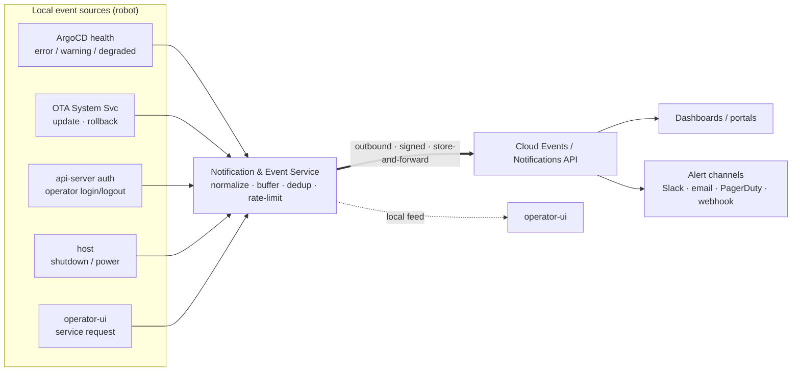

---

## 10. Component D — On-Robot AI Assistant (logs + proprioception)

> **Status: preliminary / integration sketch.** The on-robot LLM is being
> built as a **separate workstream**. This section is **not a design** for
> it — it is a placeholder describing how the deployment platform would
> *integrate* with it, to be firmed up as that workstream lands. Treat the
> specifics below as indicative, not committed.

An **on-robot, real-time LLM** — *being built as a separate workstream* —
that continuously analyzes the robot's logs **and live proprioception**
(joint positions/velocities/torques, IMU, EtherCAT state, control
residuals). This RFC does not specify that model; it **integrates** with
it as the deployment platform's intelligence layer.
The assistant: (1) **proactively signals potential errors and warnings**
in real time before they harden into failures, (2) **generates
root-cause analyses (RCAs)** for errors that have already occurred, (3)
answers operator questions through a **chat** interface ("why did
dma-streams restart?", "what changed before this fault?"), and (4)
**recommends maintenance tasks** that populate the task timetable
(§3 ⑥) — e.g. "joint 7 torque ripple trending up, schedule re-zero".

It is **advisory only** — read-only, with no control authority. It can
raise a notification (§9), draft an RCA, or propose a task, but it cannot
apply, roll back, or mutate config. Humans and the existing gates remain
in the loop.

### Inputs / outputs

| | |
|---|---|
| **Reads** | **live proprioception** (joint state, IMU, torques, EtherCAT state) · workload + host logs (Area 3) · structured event stream (§9) · deploy history (applied versions, rollbacks) · **issue history & resolutions** (§3 ⑤) as retrieval context |
| **Signals** | real-time potential errors / warnings → Notification & Event Service (§9) → dashboards + alert channels |
| **RCAs** | for errors that occurred: correlate logs + proprioception + the recent deploy + prior resolutions → an evidence-cited RCA attached to the event/issue, shown in operator-ui / portal |
| **Task recommendations** | predictive-maintenance proposals (re-zero, ecat re-alias, recalibration) → task timetable (§3 ⑥), operator-confirmed |
| **Chat** | operator Q&A in operator-ui — works **on-robot even when disconnected**; also mirrored in the portals |

### Where it runs

- **On-robot, real-time** (the model this workstream is building). Local
  analysis means proprioception is available at rate and chat/RCA work
  while disconnected. RCAs, signals and summaries sync **outbound** to the
  cloud (robot-initiated, via §9) for dashboards and the portal mirror —
  preserving the air-gap; nothing inbound required.

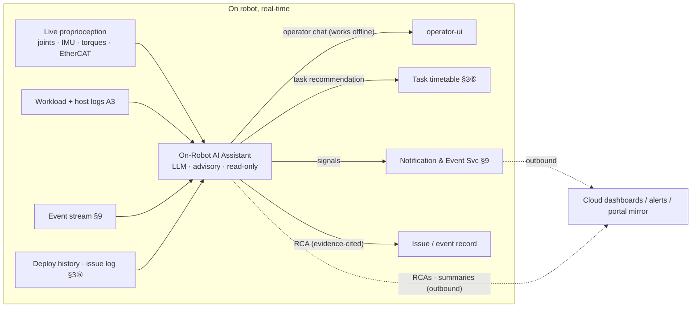

---

## 11. Interaction models

### Model 1 — Happy path (auto rollout)

Maps to steps ①–⑩ in §4.

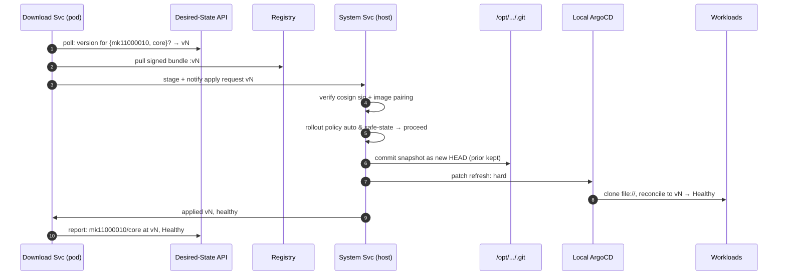

### Model 2 — Operator-approval gate (staged rollout)

Used for risky changes or canary tiers. The bundle's
`rolloutPolicy: approval` holds the apply until a human or canary signal
releases it.

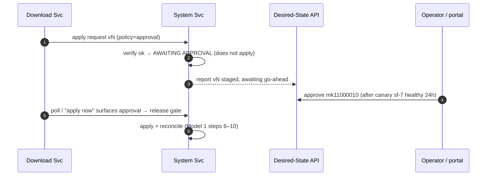

### Model 3 — Failure & auto-rollback (no network needed)

A bad snapshot must never strand the robot. Recovery uses only local
state — the previous HEAD is already on disk.

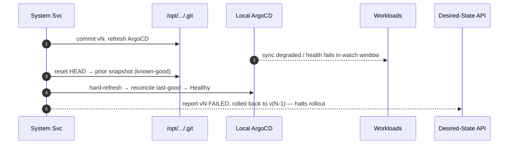

---

## 12. Roles & responsibilities

| Component | Runs where | Owns / does | Explicitly NOT responsible for | Privilege |
|---|---|---|---|---|
| **Config Repo/S3 + Cloud ArgoCD** | Cloud | Author hierarchy; render per-robot leaf; build, sign & promote bundles; declare desired version + rollout policy | Reaching into any robot cluster; robot-local physical wiring | Cloud-only; no robot access |
| **Artifact Registry** | Cloud | Store immutable, signed, versioned config+image bundles; serve pulls | Deciding who gets what version | Read = pull-token; write = CI only |
| **Desired-State API** | Cloud | Source of truth for `{robot}→version`; accept approvals; ingest robot health reports | Pushing to robots (it is polled, never initiates) | Robot identity-scoped tokens |
| **Cloud portals (site/customer/global)** | Cloud · A4 | Hierarchical fleet views; drive rollouts at each scope; render dashboards (progress + state) | Direct robot connections; bypassing desired-state | Cloud API auth (role-scoped by tier) |
| **OTA Download Service** | Robot · in-cluster pod | Poll/call-home, pull, integrity-check, stage to quarantine, notify, report status upward | Verifying signatures for trust; mutating `/opt`; applying; deciding to apply | Outbound net + write to staging dir only |
| **OTA System Service** | Robot · host systemd | Verify sig + image pairing; enforce gate + locked-field rejection; commit A/B HEAD; trigger ArgoCD; health-watch; auto-revert; service host-config applies | Any network I/O to cloud; choosing the target version | Root on node; writes `/opt/…/.git` + `/etc/phantomos`; no inbound net |
| **Local ArgoCD** | Robot · in-cluster | Reconcile cluster to `file:///opt/…` HEAD (unchanged); provide RBAC-gated exec (container shell) | Talking to GitHub/cloud; choosing revisions; editing host files | In-cluster; repo-server hostPath read-only |
| **operator-ui + phantomos-api-server** | Robot · in-cluster (+ UI) | Auth; "check & apply now" / approval-release; deployed-manifest & state view + post-update checklist results; submit validated `host-config.yaml` edits (Apply); JSON/YAML config editor — commit to local git + push to remote with version bump, operator name & reason (§3⑦); issue history log (§3⑤); task timetable (§3⑥); operator utilities (joint-zero, ecat-alias) & log views | Writing `/opt` or `/etc/phantomos` directly; editing locked fields; bypassing the apply gate | Authenticated session; calls host service over a local socket |
| **Notification & Event Service** | Robot · in-cluster pod | Subscribe to local sources; normalize, buffer, dedup, rate-limit; emit signed events outbound; expose local feed | Inbound network; mutating OS/config; deciding alert policy (cloud fans out) | Outbound net + local read of event sources + persistent queue |
| **On-Robot AI Assistant** | Robot · on-device, real-time | Read live proprioception + logs + events + deploy/issue history; signal potential errors/warnings; draft evidence-cited RCAs; recommend maintenance tasks; offline-capable chat; sync RCAs/signals outbound | Any control action (apply / rollback / config / motion); gating safety; asserting low-confidence findings as fact | Read-only on local telemetry/proprioception; outbound sync; per-tenant scoped |
| **host-config.yaml** | Robot · `/etc/phantomos` | Machine-local last-mile: dev mounts, tunables. Unlocked parts editable via operator-ui (Apply); deployed through the gated path | Policy/tuning that belongs in the cloud hierarchy | Local file; `gitSource` + identity LOCKED |
| **Operator (root SSH)** | Robot · shell | Reset locked fields (`gitSource`, identity) by re-running `bootstrap-robot.sh` | Routine config (use operator-ui) | Root via SSH — out-of-band, high-friction |

---

## 13. Artifact format & the atomicity rule

The single most important correctness property carried over from
RFC 0006: **manifests and image tags advance together.** Splitting them
across channels reintroduces `ImagePullBackOff` drift. So the OTA
artifact is *one* signed OCI bundle:

```text
registry/phantomos/mk1-core:vN      # per-SKU/variant — SHARED across robots (see §6, C3)
├── snapshot/stacks/core/all.yaml   # rendered kustomize output (manifests only; flat, hierarchy resolved)
├── image-refs.json                 # exact image digests this snapshot expects
├── meta.json                       # version, source SHA, rolloutPolicy, healthChecks, minOSVersion, config-digest
└── *.sig                           # cosign signature over the whole bundle
```

The bundle carries **manifests + image-refs only**. Per-robot config files (§6) are fetched separately
from S3 and **pinned by digest** in `meta.json` (`config-digest`), which the System Service verifies
before commit (§8). Because the per-robot data is out of the bundle, the tag is **per-SKU/variant and
shared**, not per-robot — see C3 for the storage rationale.

**Image-pairing gate (decided: gated two-step).** Images are pulled by
the Download Service first; the System Service refuses to apply until
every digest in `image-refs.json` is in the local containerd store. Never
apply config the robot can't actually run.

---

## 14. Security model

- **Provenance:** bundles signed in CI; public key baked into the OS
  image. The privileged system service verifies before reading — a
  compromised registry or MITM cannot get code onto a robot.
- **Least privilege split:** network-facing pod has zero OS-write rights;
  OS-writing service has zero inbound network. An attacker needs both to
  compromise a robot.
- **Pull-only tokens** (per-robot, rotatable) replace RFC 0002's "deploy
  key on every robot" — a leaked token grants *download*, not repo write,
  and signature verification still blocks tampered content.
- **Locked identity fields:** `gitSource` + robot identity changeable
  only via out-of-band root SSH + bootstrap — never over the network or
  UI, so a compromised UI/API can't repoint a robot's source.
- **Audited operator actions:** Apply, approvals, and ArgoCD exec
  (container shell) are RBAC-gated and audit-logged.
- **Confidentiality (encrypted bundles):** bundles / config artifacts may
  be **encrypted at rest** in the registry/S3 via envelope encryption (a
  per-bundle data key unwrapped by a robot-held key). The Download Service
  decrypts during staging (§7); the store never holds plaintext.
  Encryption is *confidentiality* — orthogonal to the cosign *authenticity*
  gate, which still runs before apply.
- **Event channel:** notifications are outbound-only, signed and
  per-robot authenticated; login/auth events feed security monitoring.
  Event payloads are scrubbed of secrets; alert/routing policy is decided
  cloud-side.
- **No inbound surface:** robots never listen for the fleet plane;
  nothing to scan or exploit from the cloud side.

---

## 15. Decisions

### Resolved

| Topic | Decision | Consequence |
|---|---|---|
| Image transport | **Gated two-step** | Images pulled separately; config apply blocked until every digest in `image-refs.json` is local. Smaller artifacts, layers dedupe, atomicity enforced at the apply gate. |
| Desired-state granularity | **One version per robot** | Keeps RFC 0006's one-revision-per-robot model; API tracks `robot → vN` (all stacks together). |
| Approval surface | **Both** | operator-ui for at-robot; cloud portals for staged multi-robot rollouts. Both write the same approval to the API — one backend, two front-ends. |
| Cloud ArgoCD scope | **Publishing plane only** | It reconciles cloud services (registry promotion, desired-state, portals) and *never* robot workloads — no path into a robot cluster. |
| Editing `host-config.yaml` | **Separate path + Apply button** | Not ArgoCD UI (can't write a host file). operator-ui → api-server → System Service, gated apply (§3). |
| Locked fields | **gitSource + identity locked** | Not editable from UI; require `ssh root@robot` + bootstrap reset. api-server rejects locked-field edits. |
| Update trigger | **Poll + "apply now" button** | Robots poll/call-home; a UI button forces an immediate call-home + gated apply. Can't bypass verify/health/rollback. |
| Container shell | **ArgoCD web exec, RBAC-gated** | Enable `exec.enabled` in `argocd-cm`; restrict to operator role; audit-logged. Works only for images shipping a shell. |
| OTA System Svc install | **Like dma-ethercat** | Bootstrap-applied installer Job copies baked-in artifact to hostPath + sentinel; host systemd runs it. No new install machinery. |
| Notifications transport | **Outbound, store-and-forward** | Robot-initiated event stream; buffers offline and drains on reconnect; cloud fans out to dashboards + alert channels. Routing rules live in the config hierarchy (per site/customer). |
| Post-update verification | **Operational checklist** | The HEALTH gate runs a declared operational checklist (§8) — stacks reconciled, workloads running, image match, readiness, interfaces present, resources, connectivity, log scan — deciding commit vs auto-revert. |
| Behavioral / physical safety | **Separate product (out of scope)** | Robot safety (behavioral envelopes, sim safety gates, fall avoidance) is a distinct product/RFC. This RFC gates on operational readiness only, never on behavior. |
| On-robot AI assistant | **Real-time on-device LLM, advisory** | Existing separate workstream; analyzes logs + live proprioception on-robot; signals, evidence-cited RCAs, maintenance recommendations, offline-capable chat (§10); RCAs/signals sync outbound. Read-only — no control authority. |
| Issue history log | **Per-robot, operator-facing** | Append-only: time, operator name, operator ID, resolution (+ severity/title/version). Surfaced in operator-ui (§3⑤); feeds the AI assistant's RCAs. |
| Task timetable | **Operator-facing schedule** | Upcoming tasks (maintenance, joint-zero, ecat-alias, recalibration, updates); scheduled / AI-recommended / operator-created; executed via operator utilities under safe-state; schedules, doesn't actuate (§3⑥). |

### Post-update verification vs. safety (scope boundary)

The post-apply gate is the **post-update verification checklist** in §8:
the System Service confirms the deployment is operationally correct
(stacks reconciled, workloads running, image match, service readiness,
interfaces present, resources, connectivity, log scan). All-pass →
COMMITTED; any-fail → auto-revert. The checklist is declared in
`meta.json` over a fixed node-side baseline (bundles may add checks, never
remove the baseline).

**Behavioral and physical safety are a separate product and out of scope
here.** This RFC deliberately does **not** judge whether a locomotion
policy "behaves" — only whether the deployment is operationally correct
and the system is up. Safety gating (behavioral envelopes, simulation
safety validation, fall avoidance, RT-correctness judgements) belongs to
the safety product/RFC and must not be conflated with deployment
verification.

---

## Out of scope

- Detailed designs for areas 2–5 (operator utilities, log views, cloud
  portals, factory flows) — this RFC defines their relationships and
  surfaces, not their internals.
- The cloud control-cluster topology and the `fleetctl` / portal backend
  schema.
- Distributing the OS image / `.deb` itself (inherited from RFC 0006's
  out-of-scope list).
- **Behavioral / physical robot safety** — behavioral envelopes,
  simulation safety gates, fall avoidance, RT-correctness judgements. A
  separate product; this RFC verifies *deployment* correctness only
  (§8, §15).
