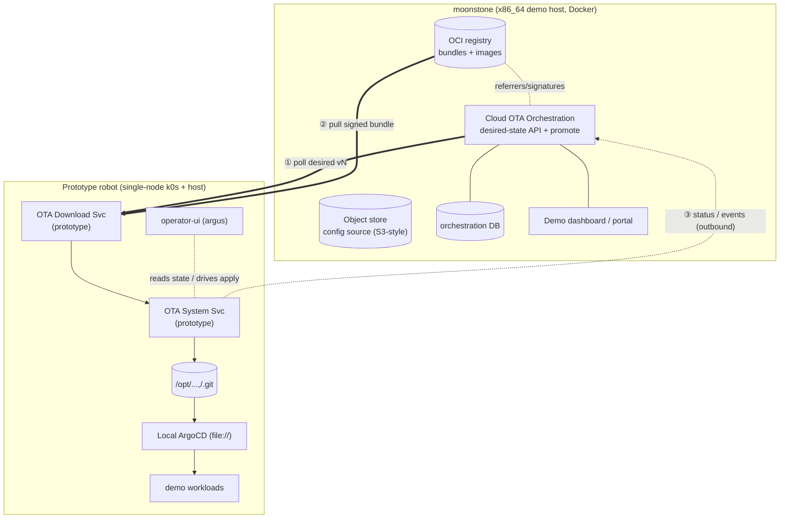
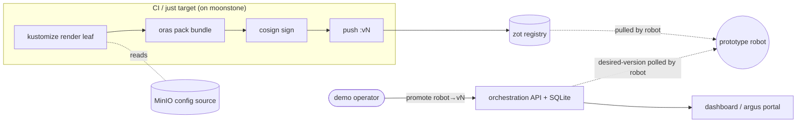
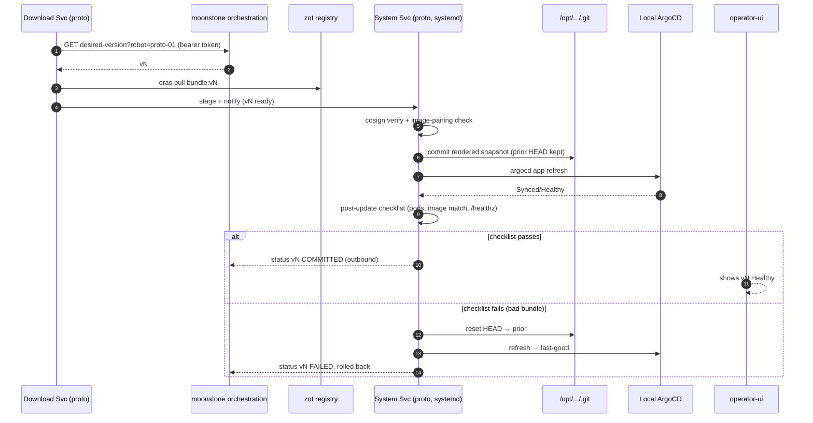

# RFC 0007 — Prototype & Demo Plan

**Status:** draft · designs only (no code)
**Companion to:** `0007-fleet-ota-and-hierarchical-config.md`, `0007-design-review.md`
**Demo host:** `moonstone` (x86_64, 32-core, RTX 5090, ~1.6 TB free, Docker + onnxruntime — dev/training host)
**Operator UI base:** `argus.operator-ui` (React 19 + TypeScript + MUI v7 + Vite)

This plan designs **throwaway-quality prototypes** of the three OTA services and a moonstone-hosted
cloud/registry, plus operator-UI mockups, to **demo the end-to-end loop** and de-risk RFC 0007 before
any production build. It is explicitly **not** the production design — many things are deliberately
faked or simplified (called out in §"What we fake / defer"). **No code here**; every fork is presented
as a *Decision* with pros/cons and a recommendation.

---

## 1. What the demo proves

A single, legible loop an operator can watch end to end:

> Edit a config value → CI renders + signs + pushes a versioned OCI bundle to the moonstone registry →
> set the robot's *desired version* → the robot **calls home**, pulls, verifies, and applies it to its
> local git tree → ArgoCD reconciles → the **operator-ui** shows live progress + the **post-update
> verification checklist** → then a deliberately-bad bundle triggers **auto-rollback**.

If that loop runs convincingly on moonstone + one prototype robot, RFC 0007's core thesis (cloud
authors, robot pulls, local ArgoCD applies, safe rollback) is validated.

**Non-goals for the prototype:** production security (real Uptane/SLSA), OS-tier updates, fleet scale,
multi-tenancy, HA. These are noted in RFC 0007 / the review and are out of scope for the demo.

---

## 2. Prototype topology

---

## 3. Decisions (with pros/cons)

### D0 — What plays "the robot" in the demo?

| Option | Pros | Cons |
|---|---|---|
| **A. Local single-node k0s** (VM or a spare NUC/box) replicating the RFC 0006 `file://`+ArgoCD setup | Real ArgoCD reconcile loop; faithful to production; no safety risk; reproducible | Must stand up k0s + ArgoCD + the hostPath git mount |
| B. A real fielded robot | Most convincing | Safety/availability risk; slow iteration; conflates demo with ops |
| C. Pure mock (no k8s; fake "apply") | Fastest to build | Proves nothing about the load-bearing ArgoCD/git mechanism |

**Recommendation: A.** A disposable single-node k0s that mirrors RFC 0006 (local git tree + read-only
hostPath + one or two ArgoCD Applications). It makes the *mechanism* real while keeping the demo safe and
re-runnable. Can run in a VM on moonstone or a spare box.

### D1 — Implementation language/runtime for the three services

| Option | Pros | Cons |
|---|---|---|
| **Go** | Native to the ecosystem we integrate (ArgoCD, `oras`, `cosign`, containerd all Go); single static binary ideal for the host System Service; great concurrency for poll/serve | Team's robotics code is C++/Java/Python — less in-house Go muscle |
| Python | Fastest to prototype; everyone here reads it; rich libs | Packaging a host daemon is clunky; not the prod-aligned path; weaker single-binary story |
| Rust | Best for a privileged host writer (safety, single binary) | Slowest to prototype; smallest in-house base |
| C++/Java | Matches existing robotics/control stack | Heavy for small network/OCI services; poor fit for the cloud side |

**Decision: all-Go** (download, system, orchestration) — chosen by the team. The prototype shares a
language with the exact tools it wraps (`oras`, `cosign`, ArgoCD client, containerd API), so the
plumbing is reusable toward production, and the System Service ships as a single static binary — the
right shape for a privileged host daemon. One language across all three keeps the demo codebase small.

### D2 — Artifact format & how the bundle is built

| Option | Pros | Cons |
|---|---|---|
| **OCI artifact via `oras`** (rendered snapshot + `image-refs.json` + `meta.json` as layers) | Matches RFC 0007 exactly; registry-native; supports referrers/signatures; reusable | Slightly more moving parts than a tarball |
| Plain tarball on the object store | Trivial | Diverges from the design; no registry/signature story; rework later |

**Recommendation: OCI via `oras`.** It *is* the RFC 0007 artifact; prototyping it now validates the
real format. The bundle is built by a simple CI step (or a `make`/`just` target for the demo).

### D3 — Registry on moonstone

| Option | Pros | Cons |
|---|---|---|
| **zot** | Lightweight, OCI-native, supports cosign + referrers, single container, vendor-neutral | Fewer enterprise features (RBAC/replication) — fine for a demo |
| CNCF `distribution` (registry:2) | Ubiquitous, dead simple | No native signature/referrers UX; barebones |
| Harbor | Full UI, RBAC, scanning, replication — demo "wow" | Heavy to stand up; overkill for a prototype |

**Recommendation: zot** for the prototype (lightweight, signature-aware). Note Harbor as the option if
the demo wants a polished registry UI on screen.

### D4 — Config source (the S3/repo half)

| Option | Pros | Cons |
|---|---|---|
| **MinIO (S3-compatible) on moonstone** | Exercises the "S3 bucket keyed by robot name" path from RFC 0007; S3 API is production-portable | One more container |
| A git repo on moonstone | Simplest; matches the "separate repo" option | Doesn't exercise the S3 path the design also calls out |
| Both (git authoring → CI → MinIO) | Most faithful | More than a demo needs |

**Recommendation: MinIO**, with the hierarchy as plain folders keyed by robot name. It demonstrates the
"separate repo *or* S3" claim using the S3 side (more novel to show), and the rendered leaf is what gets
packed into the OCI bundle.

### D5 — Cloud Orchestration service: API & datastore

| Option (API) | Pros | Cons |
|---|---|---|
| **REST/JSON over HTTPS** | Universally understood; trivial to demo with curl/Postman; easy UI integration | Less strict contract than gRPC |
| gRPC | Strong contract, streaming | Heavier tooling for a demo; harder to eyeball |

| Option (store) | Pros | Cons |
|---|---|---|
| **SQLite** | Zero-ops, single file, perfect for a single-host demo | Not multi-writer/HA (irrelevant for demo) |
| Postgres | Production-aligned | Another container for no demo benefit |

**Recommendation: REST/JSON + SQLite.** The orchestration service exposes `GET desired-version?robot=…`,
`POST promote`, `POST approve`, and `POST status` (ingest). SQLite keeps moonstone setup to one binary +
one file.

### D6 — Robot authentication to the cloud (prototype)

| Option | Pros | Cons |
|---|---|---|
| **Static per-robot bearer token** | Enough to show "scoped, revocable" without PKI overhead | Not the production answer |
| mTLS / SPIFFE | Production-aligned | Too much cert plumbing for a demo |
| None | Fastest | Misrepresents the design; bad habit |

**Recommendation: static per-robot bearer token**, with a one-line note that production uses
mTLS/SPIFFE + the Uptane-style targeting signature from the review. Cheap, but still *shows* identity.

### D7 — Signing in the prototype

| Option | Pros | Cons |
|---|---|---|
| **Real `cosign` with a local demo key** | Shows the actual verify-before-apply gate; real artifact provenance UX | Key management is demo-grade (key on disk) |
| Mocked signature (hash check only) | Trivial | Skips the single most security-relevant gate; weak demo |

**Recommendation: real `cosign`, demo key.** Sign on push, verify in the System Service before apply.
This makes the security story *visible* (flip the key → verify fails → apply refused), which is a great
demo beat, while honestly labeling it demo-grade keys (no rotation/TUF/Rekor yet).

### D8 — How the System Service applies & is installed (prototype)

| Option (apply) | Pros | Cons |
|---|---|---|
| **Commit rendered snapshot to `/opt/...,/.git`, then `argocd app refresh`** | Faithful to RFC 0006/0007; real reconcile | Needs the k0s/ArgoCD from D0 |
| `kubectl apply` directly | Simpler | Bypasses the git-HEAD/ArgoCD model the design rests on |

| Option (install) | Pros | Cons |
|---|---|---|
| **Run as a plain systemd unit / binary for the demo** | Fast; no installer plumbing | Skips the dma-ethercat-style installer (fine for a prototype) |
| Build the dma-ethercat-style installer Job now | Faithful | Premature for a demo |

**Recommendation:** commit-to-git + `argocd refresh`, run the daemon as a **plain systemd unit**. Note
the dma-ethercat-style installer as the production path. Prototype the **A/B rollback** (keep prior
HEAD) and the **post-update verification checklist** at *operational* depth (pods Healthy, image match,
a `/healthz` probe on a demo workload) — enough to show commit-vs-rollback honestly.

### D9 — Config hierarchy rendering (prototype)

| Option | Pros | Cons |
|---|---|---|
| **Real Kustomize component cascade**, two layers (global + one robot) | Proves the actual mechanism with minimal layers | Slightly more setup |
| Hard-coded single manifest | Fastest | Doesn't demonstrate the hierarchy at all |

**Recommendation: real Kustomize, two layers** (`global` + `robots/<name>`). Two layers is enough to
*show* precedence (e.g. a `RERUN_QUEUE_MB` override) without building the full customer/site tree.

### D10 — Operator-UI: extend `argus.operator-ui` or a standalone mock?

| Option | Pros | Cons |
|---|---|---|
| **Mockups first (static/animated), then graft real screens into argus** | Fast to iterate on UX; no backend coupling; argus is the real home so it ports cleanly | Mock isn't wired to live data initially |
| Wire live into argus immediately | "Real" from day one | Slows the UX exploration; couples to evolving APIs |

**Recommendation: animated mockups first** (this turn), reviewed, then implement the agreed screens in
`argus.operator-ui` against the orchestration REST API. argus's MUI v7 stack is the target aesthetic, so
the mockups are drawn MUI-flavored to port cleanly.

### D11 — Moonstone packaging: docker-compose or k8s?

| Option | Pros | Cons |
|---|---|---|
| **docker-compose** (registry + MinIO + orchestration + dashboard) | One `up`; trivial to demo and tear down; moonstone already runs Docker | Not how prod cloud would run |
| k8s on moonstone | Prod-aligned | Heavy; no demo benefit; moonstone is a workstation |

**Recommendation: docker-compose** on moonstone for the cloud side. One file stands up the whole cloud
plane; `down` cleans it. (The *robot* side still uses real k0s per D0 — that's where the k8s/ArgoCD
fidelity matters.)

---

## 4. Moonstone demo stack (cloud side)

A single docker-compose brings up:

- **zot** — OCI registry for signed bundles + demo images (D3)
- **MinIO** — S3-style config source, folders keyed by robot name (D4)
- **orchestration** — Go service: desired-state REST API + `promote`/`approve` + status ingest, SQLite (D5)
- **dashboard** — minimal portal showing per-robot version/health + a "promote" button (or the argus mock)

---

## 5. Robot-side prototype

---

## 6. What we fake / defer (scope guardrails)

| Faked / simplified in the prototype | Real design lives in |
|---|---|
| Static bearer token (not mTLS/SPIFFE) | RFC 0007 §13 + review G4 |
| Demo cosign key on disk (no rotation/TUF/Rekor) | review G4 |
| Operational checklist only (no behavioral safety) | separate safety product (RFC 0007 §14) |
| No OS/kernel/k0s tier updates | review G3 / sibling RFC |
| Two-layer hierarchy (global + robot), no customer/site | RFC 0007 §5 |
| Single robot, no fleet/canary/recall | review G5 |
| docker-compose cloud (no HA/multi-tenant) | RFC 0007 §0 areas 4 |
| Notifications/AI assistant stubbed (or simple) | RFC 0007 §8, §9 |

---

## 7. Milestones

- **M0 — Cloud plane up on moonstone:** compose stack (zot + MinIO + orchestration). Demo: `promote`
  sets a desired version, `GET desired-version` returns it.
- **M1 — Bundle pipeline:** `just` target renders the two-layer Kustomize leaf, `oras` packs, `cosign`
  signs, pushes `:vN`. Demo: bundle visible in zot, signature verifies.
- **M2 — Robot loop:** single-node k0s + ArgoCD (`file://`); Download + System services pull→verify→
  commit→refresh; operator-ui (mock or argus) shows progress + checklist. Demo: end-to-end happy path.
- **M3 — Failure beat:** a deliberately-bad bundle fails the checklist → auto-rollback to prior HEAD;
  flip the cosign key → verify fails → apply refused. Demo: the safety/rollback story, visibly.

---

## 8. Open questions for you

1. **Prototype robot host (D0):** VM on moonstone, a spare NUC/box, or other? (Recommend a disposable
   single-node k0s; where it runs is your call.)
2. ~~**Language (D1)**~~ — **decided: all-Go.**
3. **Demo polish:** zot (lightweight) vs Harbor (registry UI on screen) — how much "wow" does the demo need?
4. **UI path (D10):** mockups → graft into argus (recommended), or wire argus live immediately?
